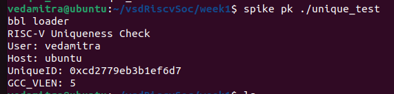

# Week 1 Report

This directory contains the source file `unique_test.c`, which demonstrates initial usage of the RISC-V toolchain.

## Compilation

To compile the file for the RISC-V architecture, use the following command:

#### riscv64-unknown-elf-gcc -O2 -Wall -march=rv64imac -mabi=lp64 -DUSERNAME=""$(id -un)"" -DHOSTNAME=""$(hostname -s)"" unique_test.c -o unique_test

This command compiles the program with optimization and warning flags, targeting the RV64IMAC architecture. It also embeds the current username and hostname into the binary using preprocessor macros.

## Running the Program

After compilation, run the executable using Spike and the proxy kernel (`pk`):

#### spike pk ./unique_test

## Final Output

The program will produce output in the terminal.  
An example output is shown below:

