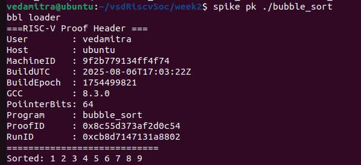

# Week 2 Report

## Compilation

To compile the files for the RISC-V architecture, use the following commands:

#### factorial.c compilation 

---

#### max_array.c compilation

---

#### bitops.c compilation

---

#### bubble_sort.c compilation

---

## Decode Instructions
### **bitops_main_objdump**

| Line | Opcode | Binary | funct3 | funct7 | rd  | rs1 | rs2 | Description |
|------|--------|--------|--------|--------|-----|-----|-----|-------------|
| `10328:	1101                	addi	sp,sp,-32` | 1101 | 00000000000000000001000100000001 | 001 | 0000000 | sp | sp | — | sp = sp + -32 |
| `1032a:	ec06                	sd	ra,24(sp)` | ec06 | 00000000000000001110110000000110 | 110 | 0000000 | — | sp | ra | MEM[sp + offset] = ra |
| `1032c:	e822                	sd	s0,16(sp)` | e822 | 00000000000000001110100000100010 | 110 | 0000000 | — | sp | s0 | MEM[sp + offset] = s0 |
| `1032e:	1000                	addi	s0,sp,32` | 1000 | 00000000000000000001000000000000 | 001 | 0000000 | s0 | sp | — | s0 = sp + 32 |
| `10330:	67f1                	lui	a5,0x1c` | 67f1 | 00000000000000000110011111110001 | 110 | 0000000 | — | — | — | a5 = 0x1c << 12 |

---

### **bubble_sort_main_objdump**

| Line | Opcode | Binary | funct3 | funct7 | rd  | rs1 | rs2 | Description |
|------|--------|--------|--------|--------|-----|-----|-----|-------------|
| `103fc:	7139                	addi	sp,sp,-64` | 7139 | 00000000000000000111000100111001 | 111 | 0000000 | sp | sp | — | sp = sp + -64 |
| `103fe:	fc06                	sd	ra,56(sp)` | fc06 | 00000000000000001111110000000110 | 111 | 0000000 | — | sp | ra | MEM[sp + offset] = ra |
| `10400:	f822                	sd	s0,48(sp)` | f822 | 00000000000000001111100000100010 | 111 | 0000000 | — | sp | s0 | MEM[sp + offset] = s0 |
| `10402:	0080                	addi	s0,sp,64` | 0080 | 00000000000000000000000010000000 | 000 | 0000000 | s0 | sp | — | s0 = sp + 64 |
| `10404:	67f5                	lui	a5,0x1d` | 67f5 | 00000000000000000110011111110101 | 110 | 0000000 | — | — | — | a5 = 0x1d << 12 |

---

### **factorial_main_objdump**

| Line | Opcode | Binary | funct3 | funct7 | rd  | rs1 | rs2 | Description |
|------|--------|--------|--------|--------|-----|-----|-----|-------------|
| `1036e:	1101                	addi	sp,sp,-32` | 1101 | 00000000000000000001000100000001 | 001 | 0000000 | sp | sp | — | sp = sp + -32 |
| `10370:	ec06                	sd	ra,24(sp)` | ec06 | 00000000000000001110110000000110 | 110 | 0000000 | — | sp | ra | MEM[sp + offset] = ra |
| `10372:	e822                	sd	s0,16(sp)` | e822 | 00000000000000001110100000100010 | 110 | 0000000 | — | sp | s0 | MEM[sp + offset] = s0 |
| `10374:	1000                	addi	s0,sp,32` | 1000 | 00000000000000000001000000000000 | 001 | 0000000 | s0 | sp | — | s0 = sp + 32 |
| `10376:	67f1                	lui	a5,0x1c` | 67f1 | 00000000000000000110011111110001 | 110 | 0000000 | — | — | — | a5 = 0x1c << 12 |

---

### **max_array_main_objdump**

| Line | Opcode | Binary | funct3 | funct7 | rd  | rs1 | rs2 | Description |
|------|--------|--------|--------|--------|-----|-----|-----|-------------|
| `10328:	7139                	addi	sp,sp,-64` | 7139 | 00000000000000000111000100111001 | 111 | 0000000 | sp | sp | — | sp = sp + -64 |
| `1032a:	fc06                	sd	ra,56(sp)` | fc06 | 00000000000000001111110000000110 | 111 | 0000000 | — | sp | ra | MEM[sp + offset] = ra |
| `1032c:	f822                	sd	s0,48(sp)` | f822 | 00000000000000001111100000100010 | 111 | 0000000 | — | sp | s0 | MEM[sp + offset] = s0 |
| `1032e:	0080                	addi	s0,sp,64` | 0080 | 00000000000000000000000010000000 | 000 | 0000000 | s0 | sp | — | s0 = sp + 64 |
| `10330:	67f1                	lui	a5,0x1c` | 67f1 | 00000000000000000110011111110001 | 110 | 0000000 | — | — | — | a5 = 0x1c << 12 |

---

## Final Output

Here is the Output including RunID & ProofID:

##### factorial.c output 

---

#### max_array.c output

---

#### bitops.c output

---

#### bubble_sort.c output

